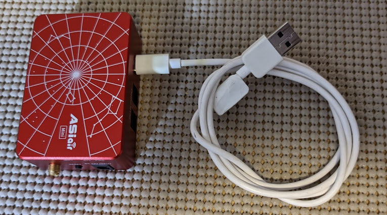
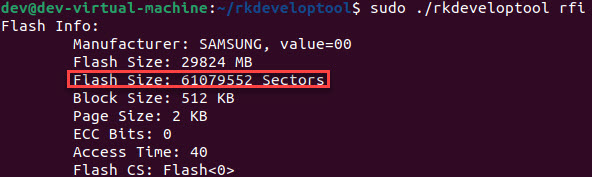

## rkdeveloptool
Used to pull images and push images on the ASIAIR Mini/Plus RockChip

### Install the default apps to compile the application
```	
sudo apt-get install libudev-dev libusb-1.0-0-dev dh-autoreconf build-essential git
```
### Download repository
```	
git clone https://github.com/open-astro/rkdeveloptool.git
```	
### Change the directory to rkdevloptool and run commands
```
cd rkdeveloptool
aclocal
autoreconf -i
autoheader
automake --add-missing
./configure
make
```
### Run help tool commands
```
./rkdeveloptool -h
```

> [!TIP]
>  You will need a USB Type-C to USB-A 2.0 Male cable and no power cable connected to boot the ASIAIR into Loader mode.
> 1. First, plug the USB-C end into the ASIAIR
> 2. Hold the Reset button down
> 3. Now plug in the USB-A 2.0 Male cable to your Linux computer and then let go of the reset button. The lights should not be lit up if done properly and the system will be in Loader mode.<br>
>

### Backing up the ASIAIR device
First we want to figure out how many sectors our device has. To check it we need to run the following command
```
sudo ./rkdeveloptool rfi
```
If you done properly we should see the following information<br>


Now we need to backup the image. This command is telling the system to us 'rl' (ReadLBA), the 0 means first block, the 61079552 is our complete sector size and the image.bin is the backup for our ASIAIR to a file.
```
sudo ./rkdeveloptool rl 0 61079552 image.bin
```